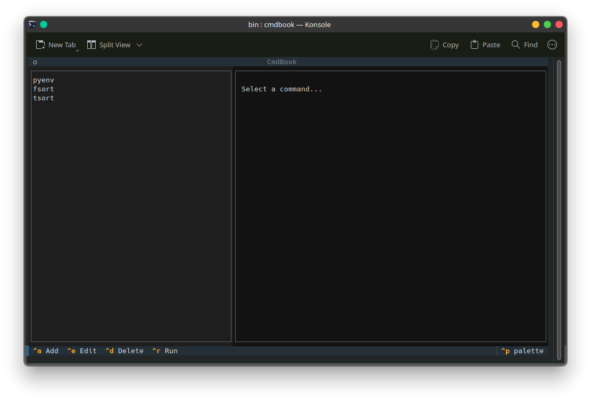
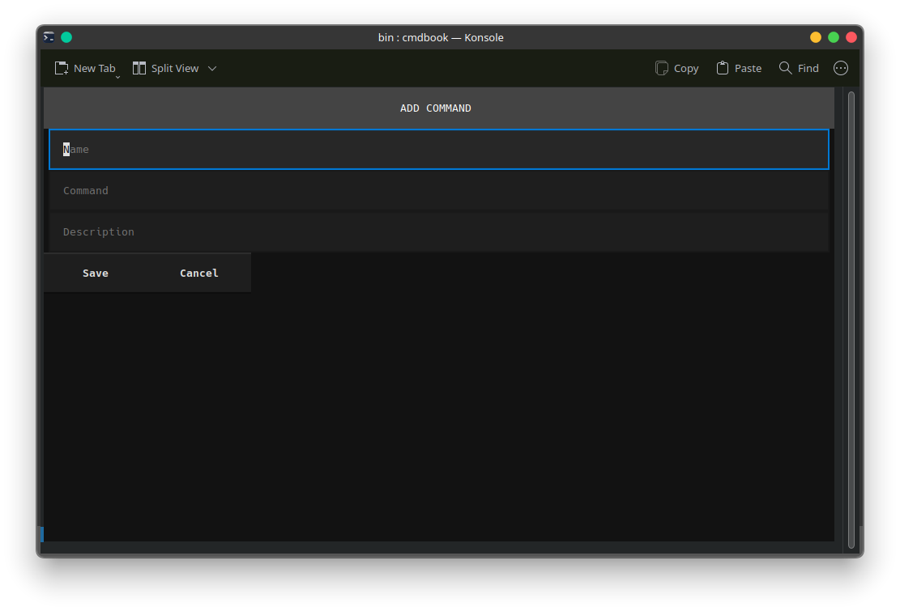
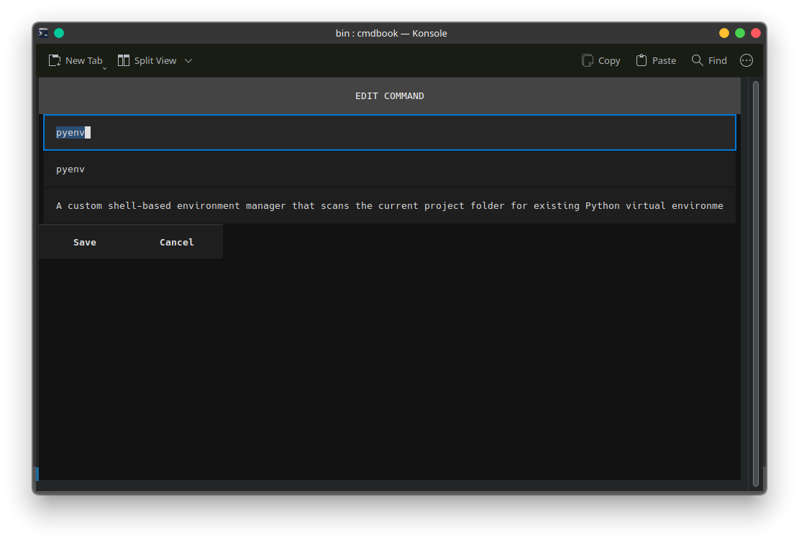
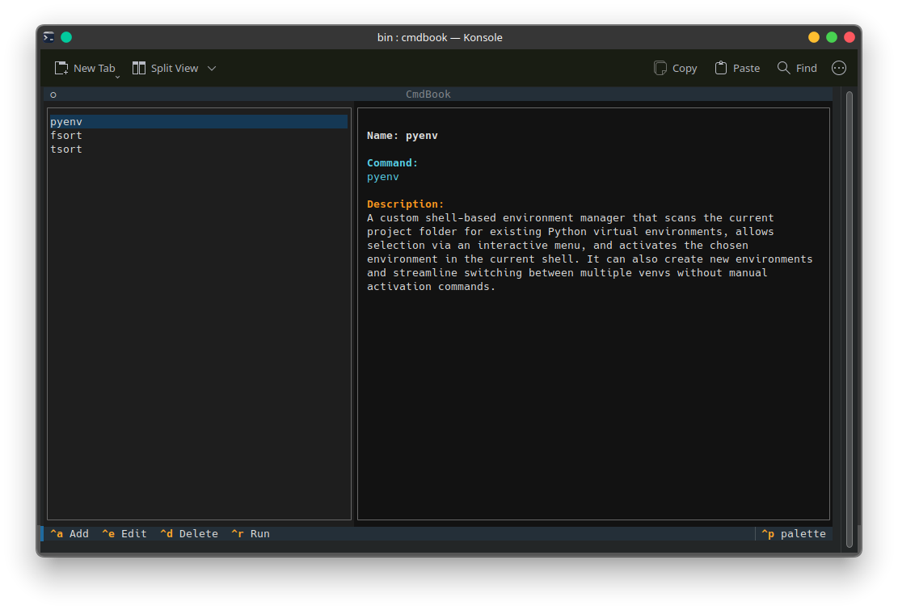
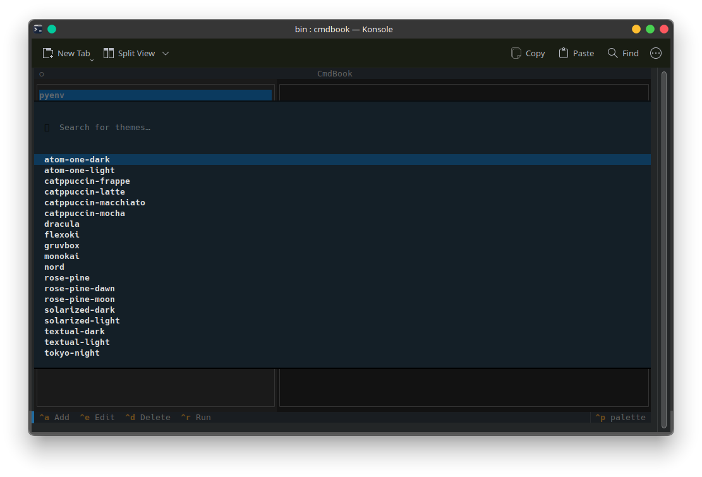

# CmdBook

CmdBook is a terminal-based command manager that helps you organize, search, and execute your frequently used CLI commands through an interactive TUI (Text User Interface).

It is designed for developers and Linux users who frequently customize their workflow and want a reliable way to store and reuse commands.

---

## Preview

### Interface



### Add Command



### Edit Command



### Manual View



### Themes



---

## Features

* Interactive TUI with keyboard navigation
* Add, edit, and delete commands
* Run commands directly from the interface
* Persistent storage using JSON
* Lightweight and fast
* Clean and minimal interface

---

## Keybindings

| Key       | Action       |
| --------- | ------------ |
| Up / Down | Navigate     |
| Enter     | Select       |
| Ctrl + A  | Add command  |
| Ctrl + E  | Edit command |
| Ctrl + D  | Delete       |
| Ctrl + R  | Run command  |

---

## Use Cases

* Store frequently used Linux commands
* Manage development shortcuts
* Keep track of automation scripts
* Build a personal command knowledge base

---

## Installation

### Linux (Manual Installation)

```bash
git clone https://github.com/arifinsiddiqzisan/cmdbook.git
cd cmdbook
pip install textual rich
sudo mv cmdbook.py /usr/local/bin/cmdbook
sudo chmod +x /usr/local/bin/cmdbook
mkdir -p ~/.cmdbook
touch ~/.cmdbook/commands.json
echo "[]" > ~/.cmdbook/commands.json
cmdbook
```

---

### Linux (User-only Installation)

```bash
mkdir -p ~/.local/bin
mv cmdbook.py ~/.local/bin/cmdbook
chmod +x ~/.local/bin/cmdbook
echo 'export PATH="$HOME/.local/bin:$PATH"' >> ~/.bashrc
source ~/.bashrc
cmdbook
```

---

### Windows Installation

1. Clone the repository:

```bat
git clone https://github.com/arifinsiddiqzisan/cmdbook.git
cd cmdbook
```

2. Install dependencies:

```bat
pip install textual rich
```

3. Create a tools directory:

```bat
mkdir C:\tools
```

4. Move the script:

```bat
move cmdbook.py C:\tools\cmdbook.py
```

5. Create a batch file (`cmdbook.bat`) inside `C:\tools\`:

```bat
@echo off
python C:\tools\cmdbook.py %*
```

6. Add `C:\tools` to Environment Variables:

* Open System Properties
* Go to Environment Variables
* Edit `Path`
* Add: `C:\tools`

7. Create data directory:

```bat
mkdir %USERPROFILE%\.cmdbook
echo [] > %USERPROFILE%\.cmdbook\commands.json
```

8. Run:

```bat
cmdbook
```

---

## Requirements

* Python 3
* pip

Linux:

```bash
sudo apt install python3-pip
pip install textual rich
```

Windows:

```bat
pip install textual rich
```

---

## Data Storage

CmdBook stores all commands in:

```
~/.cmdbook/commands.json
```

Windows equivalent:

```
C:\Users\YourName\.cmdbook\commands.json
```

---

## Example Entry

```
Name: pyenv
Command: pyenv
Description: Manage Python virtual environments
```

---

## Tech Stack

* Python
* Textual
* Rich

---

## Philosophy

CmdBook is built with a simple idea:

Your terminal should remember what you forget.

Instead of searching for commands repeatedly, store them once and access them instantly.

---

## License

MIT License

---

## Contributing

Contributions are welcome. You can:

* Open issues
* Suggest features
* Submit pull requests

---

## Author

Zisan
